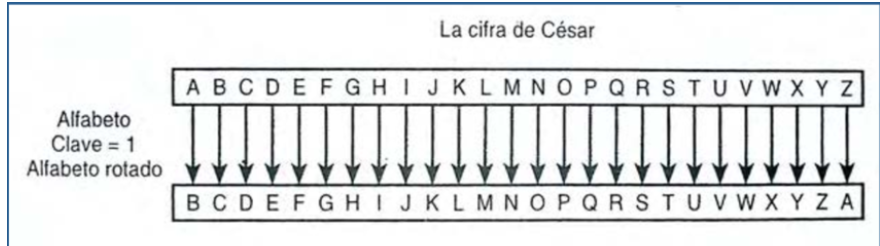

# Ejemplo de Login con Cifrado César

## Descripción

Este ejemplo muestra cómo realizar un registro y un inicio de sesión sencillos en Python utilizando el cifrado César para encriptar las contraseñas. No se utilizan funciones ni programación orientada a objetos para mantener el código simple y accesible.

El cifrado César, también conocido como cifrado por desplazamiento, código de César o desplazamiento de César, es una técnica de cifrado muy simple y una de las más utilizadas en la historia. Se basa en un tipo de cifrado por sustitución monoalfabético, en el que cada letra del alfabeto original se reemplaza por otra letra que se encuentra un número fijo de posiciones más adelante en el mismo alfabeto.

El cifrado César, también conocido como cifrado por desplazamiento, código de César o desplazamiento de César, es una técnica de cifrado muy simple y una de las más utilizadas en la historia. Se basa en un tipo de cifrado por sustitución monoalfabético, en el que cada letra del alfabeto original se reemplaza por otra letra que se encuentra un número fijo de posiciones más adelante en el mismo alfabeto.

**Funcionamiento:**

Imagina que el alfabeto original es el español, con 27 letras: "a", "b", "c", ..., "y", "z". El cifrado César funciona de la siguiente manera:

1. **Elección de la clave:** Se elige un número entero positivo, llamado "clave" o "desplazamiento". Este número indica cuántas posiciones se moverán las letras del alfabeto original. Por ejemplo, si la clave es 3, la "a" se convertirá en "d", la "b" en "e", y así sucesivamente.
2. **Sustitución de letras:** Para cifrar un mensaje, se reemplaza cada letra del mensaje original por la letra que se encuentra a la distancia de la clave en el alfabeto.

**Ejemplo:**

Supongamos que el mensaje original es "HOLA" y la clave es 3.

* La "H" se encuentra en la octava posición del alfabeto, entonces se reemplaza por la letra que está 3 posiciones más adelante, la "L".
* La "O" se encuentra en la decimoquinta posición, entonces se reemplaza por la "S".
* La "L" se encuentra en la duodécima posición, entonces se reemplaza por la "P".
* La "A" se encuentra en la primera posición, entonces se reemplaza por la "D".

El mensaje cifrado con la clave 3 sería "LSPDU".

**Descifrado:**

Para descifrar un mensaje cifrado con el cifrado César, se realiza el proceso inverso: se reemplaza cada letra del mensaje cifrado por la que se encuentra a la distancia de la clave **hacia atrás** en el alfabeto.

**Seguridad:**

El cifrado César se considera un método de cifrado débil debido a su simplicidad. Un atacante que intercepte un mensaje cifrado puede descifrarlo fácilmente utilizando técnicas como el análisis de frecuencias. Existen muchos otros métodos de cifrado más seguros que se utilizan en la actualidad.

**Sin embargo, el cifrado César sigue teniendo algunas aplicaciones:**

* **Educación:** Se utiliza como herramienta didáctica para enseñar conceptos básicos de criptografía.
* **Juegos y rompecabezas:** Se utiliza para crear mensajes secretos o acertijos.
* **Aplicaciones no críticas:** Se puede utilizar para cifrar información que no sea altamente confidencial, como contraseñas simples o mensajes personales.
* 
* 

## Código

```python
# Definimos la clave de cifrado (desplazamiento)
desplazamiento = 3

# Solicitar al usuario que ingrese su nombre de usuario y contraseña
username = input("Ingrese nombre de usuario para registrar: ")
password = input("Ingrese contraseña: ")

# Cifrado de la contraseña
password_cifrada = ""
for caracter in password:
    if caracter.isalpha():  # Verificamos si el carácter es una letra
        letra_base = ord('a') if caracter.islower() else ord('A')  # Determinamos la base (a o A)
        # Calculamos el nuevo carácter desplazado y lo agregamos al mensaje cifrado
        caracter_cifrado = chr((ord(caracter) - letra_base + desplazamiento) % 26 + letra_base)
        password_cifrada += caracter_cifrado
    else:
        password_cifrada += caracter  # Si no es letra, lo dejamos igual

# Simulación de una base de datos de usuarios
users_db = {}
users_db[username] = password_cifrada
print("Usuario registrado exitosamente!")

# Solicitar al usuario que ingrese su nombre de usuario y contraseña para iniciar sesión
login_username = input("Ingrese nombre de usuario para iniciar sesión: ")
login_password = input("Ingrese contraseña: ")

# Cifrar la contraseña ingresada para comparar
login_password_cifrada = ""
for caracter in login_password:
    if caracter.isalpha():  # Verificamos si el carácter es una letra
        letra_base = ord('a') if caracter.islower() else ord('A')  # Determinamos la base (a o A)
        # Calculamos el nuevo carácter desplazado y lo agregamos al mensaje cifrado
        caracter_cifrado = chr((ord(caracter) - letra_base + desplazamiento) % 26 + letra_base)
        login_password_cifrada += caracter_cifrado
    else:
        login_password_cifrada += caracter  # Si no es letra, lo dejamos igual

# Verificar las credenciales
if login_username in users_db:
    stored_password_cifrada = users_db[login_username]
    if login_password_cifrada == stored_password_cifrada:
        print("Inicio de sesión exitoso!")
    else:
        print("Contraseña incorrecta.")
else:
    print("El usuario no existe.")
```

---

# Explicación del Código

### Registro:

1. Se solicita al usuario un nombre de usuario y una contraseña.
2. La contraseña se cifra utilizando un desplazamiento de 3 posiciones en el alfabeto.
3. Se almacena el nombre de usuario y la contraseña cifrada en un diccionario users_db.

### Cifrado de la contraseña:

1. Para cada carácter en la contraseña, se verifica si es una letra.
2. Si es una letra, se determina la base (a para minúsculas, A para mayúsculas).
3. Si no es una letra, el carácter se agrega tal cual.

### Inicio de sesión:

1. Se solicita al usuario que ingrese su nombre de usuario y contraseña.
2. La contraseña ingresada se cifra utilizando el mismo desplazamiento.
3. Se verifica si el nombre de usuario existe en `users_db`.
4. Si existe, se compara la contraseña cifrada ingresada con la almacenada.
5. Si coinciden, se muestra un mensaje de éxito; de lo contrario, se indica que la contraseña es incorrecta.

---

# Ejemplo de Login con bcrypt

## Descripción

Este ejemplo muestra cómo realizar un registro y un inicio de sesión sencillos en Python utilizando la librería `bcrypt` para encriptar las contraseñas.

## Instalación de `bcrypt`

Primero, asegúrate de que todos instalen la librería `bcrypt` con pip:

```bash
pip install bcrypt
```

## Código

```python
import bcrypt

# Simulación de una base de datos de usuarios
users_db = {}

# Registro de usuario
username = input("Ingrese nombre de usuario para registrar: ")
password = input("Ingrese contraseña: ")

salt = bcrypt.gensalt()
hashed_password = bcrypt.hashpw(password.encode(), salt)

users_db[username] = hashed_password
print("Usuario registrado exitosamente!")

# Inicio de sesión
login_username = input("Ingrese nombre de usuario para iniciar sesión: ")
login_password = input("Ingrese contraseña: ")

if login_username in users_db:
    stored_hashed_password = users_db[login_username]
    if bcrypt.checkpw(login_password.encode(), stored_hashed_password):
        print("Inicio de sesión exitoso!")
    else:
        print("Contraseña incorrecta.")
else:
    print("El usuario no existe.")
```

---

## Explicación del Código

### Registro:

1. Se solicita al usuario un nombre de usuario y una contraseña.
2. Se genera una sal con `bcrypt.gensalt()`.
   - **Sal (Salt)**: Un valor aleatorio que se añade a las contraseñas antes de encriptarlas para asegurar que dos contraseñas idénticas no produzcan el mismo hash. Esto mejora la seguridad al dificultar ataques de diccionario y de fuerza bruta.
3. La contraseña se encripta usando `bcrypt.hashpw(password.encode(), salt)`.
4. Se almacena el nombre de usuario y la contraseña encriptada en un diccionario `users_db`.

### Inicio de sesión:

1. Se solicita al usuario que ingrese su nombre de usuario y contraseña.
2. Se verifica si el nombre de usuario existe en `users_db`.
3. Si existe, se recupera la contraseña encriptada almacenada.
4. Se compara la contraseña ingresada con la almacenada usando `bcrypt.checkpw(login_password.encode(), stored_hashed_password)`.
5. Si la contraseña coincide, se muestra un mensaje de éxito; de lo contrario, se indica que la contraseña es incorrecta.

---

### ¿Qué es una sal (salt)?

Una sal es un valor aleatorio único que se añade a cada contraseña antes de aplicarle un algoritmo de hash como bcrypt. Este valor aleatorio se concatena con la contraseña y luego se aplica la función hash. La sal asegura que incluso si dos usuarios tienen la misma contraseña, sus hashes en la base de datos serán diferentes debido a la sal única.

### Función de la sal en bcrypt:

1. **Unicidad**: Cada vez que se genera una sal con bcrypt, se obtiene un valor único y aleatorio. Esto significa que aunque dos usuarios tengan la misma contraseña, sus hashes en la base de datos serán diferentes debido a las sales únicas.
2. **Seguridad mejorada**: La adición de una sal hace que las contraseñas sean más difíciles de crackear mediante ataques de fuerza bruta y tablas de arco iris (rainbow tables). Incluso contraseñas comunes o simples tendrán hashes diferentes debido a las sales únicas asociadas.
3. **Prevención de ataques precomputados**: Los ataques de fuerza bruta y las tablas de arco iris generalmente aprovechan el hecho de que las contraseñas comunes pueden tener hashes precalculados. Con una sal, cada contraseña necesita ser atacada individualmente, lo que aumenta enormemente el tiempo y la dificultad para comprometer contraseñas.

### Proceso en bcrypt:

- **Generación de la sal**: bcrypt genera una sal aleatoria y única utilizando un generador de números aleatorios criptográficamente seguro.
- **Concatenación**: La sal se concatena con la contraseña original antes de aplicar la función hash.
- **Almacenamiento**: Tanto la sal como el hash resultante se almacenan juntos en la base de datos. La sal no es un secreto y suele ser visible junto con el hash en la base de datos.
- **Verificación**: Cuando un usuario intenta iniciar sesión, la contraseña ingresada se concatena con la sal almacenada, y luego se calcula su hash. Este hash se compara con el hash almacenado en la base de datos para verificar la autenticidad de la contraseña.

### ¿Qué es una algoritmo de Hash?

Un algoritmo de hash es como una fórmula matemática especial que convierte datos, como texto o archivos, en una secuencia corta de letras y números. Esta secuencia única se llama "hash" o "valor hash".

### Características clave de los algoritmos de hash:

1. **Transformación unidireccional**: Los algoritmos de hash convierten los datos en un hash, pero no se puede revertir para obtener los datos originales. Es como si convirtieras una receta de cocina en una receta más corta que no puedes volver a alargar.
2. **Consistencia**: Siempre que se use el mismo algoritmo con la misma entrada, se obtendrá el mismo hash. Esto garantiza que sea predecible y útil para verificar datos.
3. **Eficiencia**: Los algoritmos de hash son rápidos y eficientes, incluso con grandes cantidades de datos. Pueden transformar un archivo grande en un hash en poco tiempo.
4. **Unicidad y colisiones**: Idealmente, cada conjunto único de datos debería producir un hash único. Sin embargo, debido a la limitación de espacio en el hash (por ejemplo, 256 bits para SHA-256), es posible que dos conjuntos diferentes de datos produzcan el mismo hash, lo que se llama una "colisión".

### Usos comunes de los algoritmos de hash:

- **Seguridad de contraseñas**: Las contraseñas se almacenan como hashes en lugar de texto plano. Esto protege las contraseñas de ser comprometidas si la base de datos es accesible por terceros.
- **Integridad de datos**: Se utilizan para verificar que los datos no se hayan alterado durante la transmisión o el almacenamiento. Por ejemplo, puedes verificar si un archivo descargado es idéntico al original comparando sus hashes.
- **Indexación y búsqueda eficiente**: En bases de datos grandes, se utilizan para generar claves únicas que aceleran la búsqueda y recuperación de datos.

En conclusión, los algoritmos de hash son herramientas poderosas en la informática moderna que permiten seguridad, verificación y eficiencia en una amplia gama de aplicaciones.
